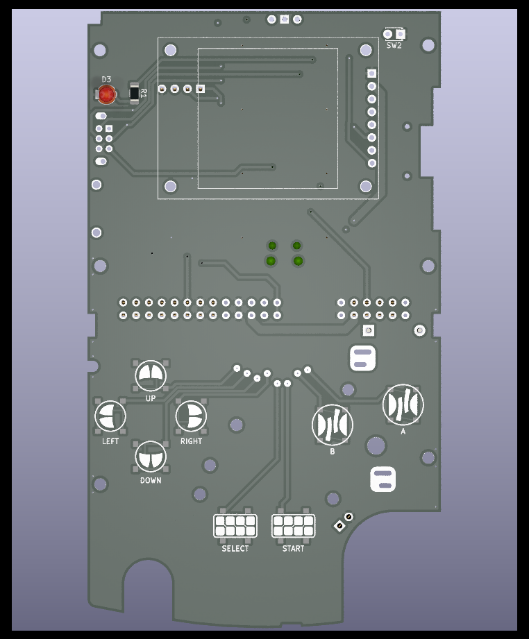
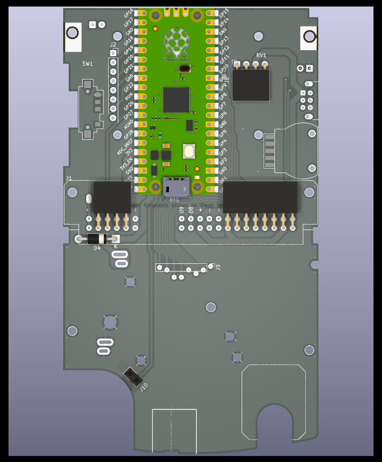

# Game Boy Color-inspired Tricorder.

A mobile sensor logger, based on the Raspberry Pi Pico and fit into a Game Boy Color reproduction case.

## Display
For now, I'm using a cheap 1.54" 240x240 ST7789 color SPI display module from AliExpress.

This resolution matches the PicoSystem, so notionally assets developed for one will work on the other.

I plan on running this at 120x120 resolution both to make development easier and to save memory.

This display does not fit the full area the CGB sets aside for a display. I might change this part if I can find a better fit, but a larger or higher resolution display will use more power and a higher resolution display will be more difficult to develop for.
## Analog Sensors
The Raspberry Pi Pico's three analog pins are currently assigned as:

- ADC0 - Wired to the position of the Status Light in the CGB form factor. It's intended that either a status LED or a photoresistor can be placed here.
- ADC1 - Wired to EXT Port pin 2. Made available either through the EXT port, or through a separate breakout in the "Cartridge Connector" area.
- ADC2 - Volume Wheel in the CGB form factor to detect values from a potentiometer.
## EXT Port (Link Cable)
Four GPIO are dedicated to the Link Cable, allowing for any types of sensors (analog, digital, I2C, UART, or SPI) to be used through a modified link cable or through a custom connector (2x3 footprint with 1mm pitch).

All or most of these pins are also available elsewhere on the board.
## Modular Sensors
For my own use, I plan to attach both a CO2 sensor and some sort of temperature/humidity sensor.

It might be possible to use both I2C channels, both UART channels, one SPI channel, one analog channel, and several digital channels for sensors if those channels aren't already being used by the EXT Port or another sensor.

Unfortunately, there isn't a consistent pinout used for sensors and the Pi Pico isn't especially flexible with how pins can be used, so I kind of just have to guess and then hope for the best.

- SGP30 uses I2C1 code 0x58
- BME280 uses I2C1 code 0x76 or 0x77

| Bus   | Main Use       | Pins                   |
| ----- | -------------- | ---------------------- |
| I2C0  | EXT Port       | GP12, GP13             |
| I2C1  | Sensors        | GP10, GP15             |
| UART0 | EXT Port       | GP12, GP13             |
| UART1 | Headphone Jack | GP08, GP09             |
| SPI0  | Display        | GP18, GP19, GP20, GP21 |
| SPI1  | EXT Port       | GP12, GP13, GP13, GP27 |
## Buttons
The Boycorder has eight buttons, based on the same conductive silicone design as the original Game Boy. All buttons are normally floating, and grounded when pressed.

Currently, each button is wired directly to a GPIO. In the future, I may use an IO expander or matrix to free up some GPIO.

| Button | Pin  | Notes                         |
| ------ | ---- | ----------------------------- |
| UP     | GP07 | Broken out to cartridge slot. |
| LEFT   | GP05 |                               |
| DOWN   | GP03 |                               |
| RIGHT  | GP01 |                               |
| SELECT | GP00 | Broken out to cartridge slot. |
| START  | GP02 | Broken out to cartridge slot. |
| B      | GP04 |                               |
| A      | GP06 |                               |
## Power Management
This design mostly depends on the internal power management of the Raspberry Pi Pico. It can accept either two AA batteries or one 14500 with a dummy battery to bridge the other battery slot.

A diode will automatically switch to the highest voltage volume source. Safe input voltage range is 1V8 to 5V5. Batteries need to be charged externally.
## Speaker or Fan
A single GPIO is dedicated to run either a speaker, a fan, or any other component that would physically fit into the CGB's speaker area. A small fan controlled over PWM is intended here, to support air flow to sensors.
## Circuit Board
This PCB is currently untested.

Board needs to be 1.0mm to fit in case. An ENIG finish is best for button performance.
